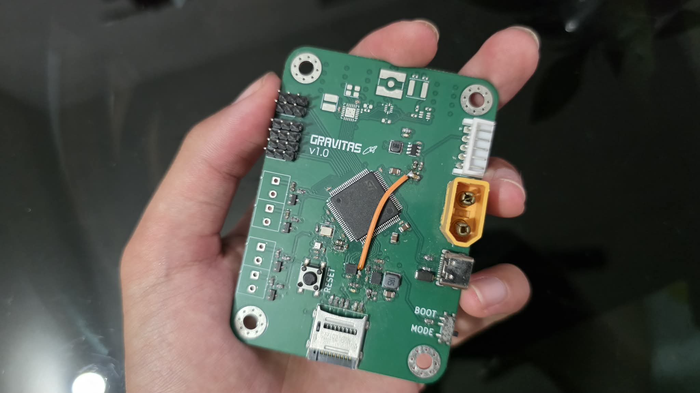

# 

### A **flight computer** to do met- I mean math for a **rocket** (_Supposedly for a self-landing rocket_).

I had a lot of fun designing this project, though there may still be a few mistakes here and there, so forgive me for that



Feel free to suggest improvements, modify the design, or contribute your own ideas to the project as well!

**Demo:** [Click me!](https://app.slack.com/client/E09V59WQY1E/unified-files/doc/F0BRU0S7W5R)

# PCB Preview


Yes, its 4 layers ;3


# Schematics


# Extra Info

1. **Use a 2s LiPo battery** if you decide to use this board in your project. **Discard the battery if it smells "funny".**

2. **Check for any damage on the pcb** as it can be the reason for a **catastrophic failure**.

3. **USE A 915MHz SMA ANTENNA ONLY!** Others will work fine but you'll spend a while wondering about the poor range.

# Firmware Flashing Instructions

### 1. Clone the repository

```bash
git clone git@github.com:GoTouchGra55/GRAVITAS.git
```

### 2. Open the project in a code editor

Navigate into the firmware directory. For VS Code users:

```bash
cd GRAVITAS
code .
```

### 3. Edit the code

You have all the freedom to implement your own new features. Infact, I encourage you to do so.

Just be sure to add your drivers to the `CMakeLists.txt` file or you'll be stuck with a nasty build error and wonder why your code won't work.

_(Speaking from experience)_

### 4. Build the firmware

```bash
cmake --preset Debug
cmake --build --preset Debug
```

### 5. Connect the ST-Link debugger

Connect the pins according to the silkscreen and the debugger labels.

Note: You can skip the 3.3V if your board is powered by an external power source.

### 6. Flash the firmware

With the ST-Link connected, press the Debug button in VS Code.

Cortex-Debug will launch the debugger and program the generated .elf file into the STM32's internal flash.

Once the firmware has been flashed, you can stop the debugging session.

### 7. Disconnect the ST-Link

You can now disconnect the ST-Link from the GRAVITAS board before testing standalone operation.

The ST-Link is connected to the STM32's debug and reset circuitry. Leaving it connected can affect the NRST line and prevent the board from operating correctly when powered independently.

I faced this error during the final phases of development and thought that it was a hardware error from my part, but really, it's the debugger. So, always remove before testing standalone operation.

### 8. Power the board

Disconnect USB and power GRAVITAS from a suitable power source.

The STM32 should now boot directly from its internal flash and execute the newly flashed firmware.

# Bill Of Materials

### See [BOM](Gravitas-bom.csv)

# License

### MIT License - see [LICENSE](LICENSE)

# Author

### **Shaurya Tamang**

Contact: shauryatamang.dev@gmail.com
